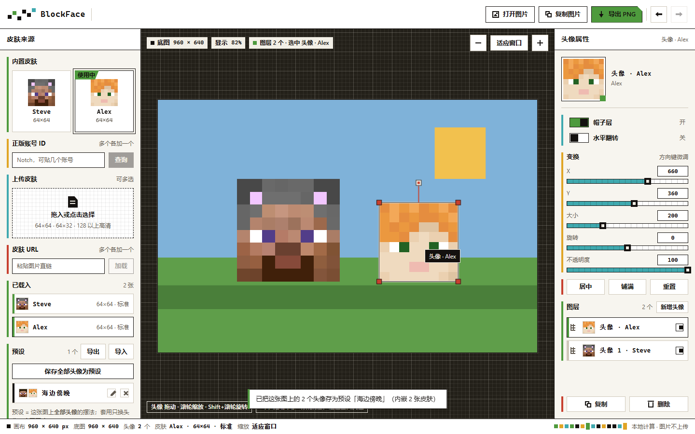

# BlockFace

> 纯前端 Minecraft 头像贴图与头图合成工具 —— 在浏览器中为图片自由拼贴 Minecraft 像素头像，零服务端上传，开箱即用。

[](LICENSE)
[](https://vuejs.org/)
[](https://vitejs.dev/)
[](https://www.typescriptlang.org/)

---



## ✨ 核心特性

- 🔒 **纯本地计算**：无服务端、无账户体系。底图与皮肤解析、图层合成全部在浏览器端本地完成，保护用户隐私。
- 🧩 **多源皮肤加载**：
  - 内置经典 Steve / Alex 皮肤；
  - 支持正版 Minecraft 玩家 ID 单个或批量检索；
  - 本地皮肤 PNG 文件拖放或多选上传；
  - 外部图片 URL 直链快速加载。
- 📐 **像素完美渲染**：
  - 自动适配 64×64 标准版、64×32 旧版、以及 128/256/512 等高清（HD）皮肤贴图；
  - 严格采用最近邻像素采样（Nearest-Neighbor），告别模糊；
  - 支持正版第二层（帽子层 / Overlay）一键开关与水平镜像翻转。
- 🖱️ **直观的手势与画布控制**：
  - 画布视口平移与基于光标锚点的连续缩放；
  - 图层等比缩放、定轴旋转、拖拽定位、透明度微调与键盘精确移动。
- 💾 **图层预设系统**：
  - 支持将画布上的头像排版一键保存为预设，方便多图批量套用；
  - 支持预设配置（JSON）导出与导入，包含完整内嵌皮肤，跨设备即开即用。
- ⚡ **开箱即用导出**：支持一键导出原尺寸高清 PNG 或直接拷贝图像至剪贴板。

---

## 🚀 快速上手

### 环境要求
- Node.js 18.0 或更高版本
- 包管理器：`npm` / `pnpm`

### 安装与启动

```bash
# 克隆仓库
git clone https://github.com/jsucraft/BlockFace.git
cd BlockFace

# 安装依赖
npm install

# 启动本地开发服务
npm run dev
```

启动后用浏览器访问 `http://localhost:5173/` 即可使用。

### 构建生产

```bash
# 检查类型并构建生产产物
npm run build

# 本地预览生产构建产物
npm run preview
```

### 测试验证

```bash
# 运行单元测试 (Vitest)
npm test

# 运行真实浏览器端到端冒烟测试 (基于本机 Chrome DevTools Protocol)
npm run e2e
```

---

## ⌨️ 快捷键与操作指南

| 操作 | 交互方式 | 说明 |
| :--- | :--- | :--- |
| **画布平移** | 空白处拖拽鼠标 | 拖动画布视口，不影响图层坐标 |
| **画布缩放** | 空白处滚动滚轮 / 触控板捏合 | 以当前光标位置为锚点连续缩放 |
| **头像缩放** | 光标停在头像上 + 滚动滚轮 | 等比放大或缩小头像 |
| **头像旋转** | 光标停在头像上 + `Shift` + 滚动滚轮 | 每次旋转 5° |
| **精确移动** | 方向键 `↑` `↓` `←` `→` | 每次移动 1 像素，按住 `Shift` 加速为 10 像素 |
| **删除图层** | `Delete` / `Backspace` | 删除当前选中的头像图层 |
| **撤销 / 重做** | `Ctrl+Z` / `Ctrl+Shift+Z` (Mac: `⌘+Z` / `⌘+Shift+Z`) | 完整的操作历史记录 |
| **导入底图** | 拖拽图片至窗口任意区域 | 或点击顶部「打开图片」按钮 |

---

## 🎨 设计语言：8px Blockgrid

BlockFace 界面采用严格的 **8px 积木网格（Blockgrid）** 体系：
- **纯 CSS 像素手搓图标**：零 emoji、零位图字体，使用纯 CSS 方块拼装，保持纯粹的像素复古美感。
- **全平涂硬边**：零圆角、零渐变、零模糊阴影，依托 1px 细线、4px 语义色条与清晰的层次划分。
- **高对比度标准**：全界面文字与核心控件均经过 WCAG AA / AAA 级别对比度审计。

详细设计规范请参阅 [设计规范文档](docs/brand-spec.md)。

---

## 📚 更多文档

- [品牌与界面设计规范 (Brand & Design Spec)](docs/brand-spec.md)：色彩令牌、排版阶梯、组件语法与交互细则。
- [技术设计与实现要点 (Product & Technical Facts)](docs/product-facts.md)：Mojang API 限制、皮肤 UV 贴图算法、画布坐标系与视口变换数学。
- [界面需求规格说明 (Design Spec)](docs/design-spec.md)：产品定位与信息架构。

---

## 📄 开源许可与声明

- 采用 [Apache License 2.0](LICENSE) 开源协议。
- 第三方资产与依赖致谢请见 [NOTICE](NOTICE)。
- **免责声明**：BlockFace 是一个兼容 Minecraft 皮肤格式的独立第三方工具，与 Mojang Studios / Microsoft 没有任何官方隶属关系。Minecraft 是 Mojang Studios 的注册商标。
